# 信息部工作指南 2026版

## 通用卷

### 人员篇

#### 高一干事

2026 年 9 月加入的新成员，本届信息部的主力干将

| | 剪辑（组长） | 剪辑 | 主持 | 主持 | 摄影 | 摄影 |
| --- | --- | --- | --- | --- | --- | --- |
| 一组 | 袁翊逍 6 | 吴佩桐 10 | 陈欣睿 3 | 翟宁远 9 | 侯乐斌 2 | 宋璇奕 16 |
| 二组 | 席乐晗 2 | 熊家祯 1 | 孟沁莺 16 | 官博宇 9 | 金昱航 8 | 戴可欣 10 |
| 三组 | 王悦灵 15 | 丁涵 7 | 季诗凡 2 | 徐嘉意 8 | 舒圣轩 9 | 蒋奕涵 16 |
| 四组 | 王淇澳 6 | 唐睿怡 2 | 邓心杰 10 | 巩亦宸 9 | 叶恩哲 4 | 高远荻 1 |

*姓名后方的数字表示班级

#### 高二干事

2026 学年在信息部工作的留任干事，拥有一定经验，指导高一新干事们完成工作

| 姓名 | 班级 | 特长 | 负责范围 |
| --- | --- | --- | --- |
| 刘梓墨 | 高二（8）班 | 剪辑、摄影 | 主要负责一 三组工作 |
| 刘晨茜 | 高二（8）班 | 主持 | 主要负责一 三组工作 |
| 杨皓喆 | 高二（11）班 | 主持 | 主要负责一 三组工作 |
| 姚启慧 | 高二（5）班 | 摄影 | 主要负责一 三组工作 |
| 陈梓萌 | 高二（5）班 | 剪辑 | 主要负责一 三组工作 |
| 李义霖 | 高二（4）班 | 剪辑、摄影 | 主要负责二 四组工作 |
| 王嘉珣 | 高二（11）班 | 主持 | 主要负责二 四组工作 |
| 王子轩 | 高二（3）班 | 主持 | 主要负责二 四组工作 |
| 杨镜桦 | 高二（10）班 | 摄影 | 主要负责二 四组工作 |

#### 指导老师

信息部属于学生会部门，受位育中学团委管辖。由于信息部的宣传部门属性，牵扯到与较多老师和部门协调沟通。

| 姓名 | 职务 | 办公室 | 主要职责 |
| ------ | ------ | -------- | ---------- |
| 金竹悦 | 团委 |  - | 学生会资金审批 |
| 王瑞璇 | 代理团委事务 | 理育楼110（心理办公室） | 布置信息部工作；<br>新闻内容审核；<br>事务性内容的传达与协调 |
| 王嘉忱 | 信息部技术指导 | 红楼207（非必要不建议前往） | 接受技术咨询；<br>周一进行视频终审和上传；<br>带领干事录制串词（演播厅）；<br>视频号内容运维 |
| 汤老师 | 600人会场管理老师 | 博育楼407 | 600人会场系统管理；<br>活动时可联系获取调音台音频，协助直播 |

#### 基本任务

信息部的主要工作是进行《位育新闻》（以下简称新闻）的制作，将新闻精彩片段制作为学校视频号内容、为公众号文章供图。

工作主要包括拍摄活动，录制串词，剪辑成片等。新闻将在每周二晨会课在全校教室播出，供同学和老师观看。（新闻内容详见组长篇）此外，信息部还可能负责完成校内老师派发的额外任务。

>**Tips:**  
>通常，校内所有活动都需要进行拍摄，但是放入新闻时需有所选择。信息部邮箱（[weiyu_xxb@163.com](mailto:weiyu_xxb@163.com)）用于信息部收集各种视频及照片材料。

---

### 场地篇

#### 剪辑室（广播室）（理育楼 108）

剪辑室用于进行新闻剪辑工作，也可能作为小型会议的开会场所。

学校器材或个人设备在此存放、充电与借还（详见设备篇）。

室内共有 4 台电脑，<span style="color: red;">**所有电脑严禁进行任何娱乐活动**</span>，其中：

- **Dell 台式机**：主要用于视频剪辑。
- **Lenovo 台式机**：一般用于照片修饰、文案撰写等。

##### 开放时间

- **周一至周四**：中午、晚间、第一节晚自习（至 19:30）
- **周五**：中午、放学后（不宜过晚）

##### 注意事项

- 信息部与综合部共用本教室，中午使用剪辑室时，在综合部干事需要时保持安静，不打扰广播收音。

- 剪辑室常锁门，备用钥匙会借给处于工作周的小组组长。

- 每天离开时关闭电脑，拔掉插座电源，关闭灯和空调。周一离开（和下一组交班）时，换垃圾袋，物品摆放整齐后离开。

- 食品和饮品带入剪辑室后应放在指定区域，禁止在剪辑室内吃东西。剪辑桌上禁止摆放任何食品和饮品，防止失手损坏设备。

- 不建议将垃圾扔在剪辑室的垃圾桶里（防止异味），如果垃圾不多，可以直接将扔到卫生间的垃圾桶中。

- 非特殊情况不要在大课间出操时使用剪辑室，如一定要使用需向团委报备。

- 若需要使用全校广播，需要先经过团委审核，再联系综合部干事播报。

*注：以前演广播站也是信息部工作内容中的一部分*

#### 演播厅（博育楼 5 楼）

用于录制新闻串词和进行部分采访，有演播桌、大屏幕、提词器等（常用），也有蓝幕、导播台、灯光台等设备（不常用）。  

##### 常用操作流程

1. 前往小房间，打开所有电闸。**先开总闸，再开分闸**。  
   ~~所有系统全部启动启动启动！还有这↑个↓~~  
   下方拖线板默认不关闭。若合闸后未听到风扇声，请检查拖线板是否正常开启。  
   空调电闸位于另一侧，空调控制面板在角落，根据体感开启。

2. 依次打开大屏幕电脑和提词器电脑（提词器的使用方法参见下文）。

3. 提前将串词文案电子版拷入 U 盘，到达演播厅后直接导入提词器电脑播放。

4. 离开时关闭空调、灯光等所有设备，然后**先关分闸，再关总闸**（标明“勿关”的除外）。

>**Tips:提词器使用教程**  
>
>*注意：需要打开提词器屏幕、主机、电脑屏幕才可以使用提词器*  
>**使用软件**：TelePrompter_V2.5.0 提词器（破解版）  
>软件安装在桌面上，已经配置完成，下附详细配置
>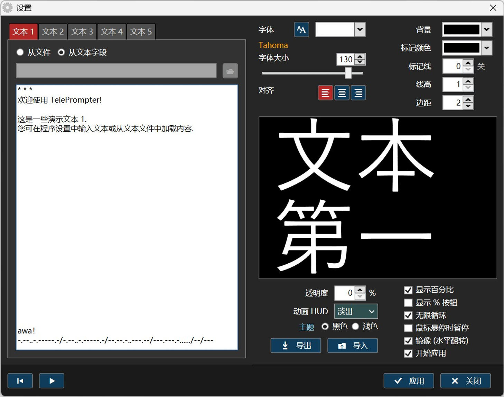
>
>**文稿设置**：  
> 右侧可以复制插入口播文本内容。字体大小根据主持的实际情况适当调整，背景设置黑色，文本颜色设置为白色，标记线设为 0（关闭），同时勾选镜像（水平翻转）。设置结束后点击应用。
>
>**播放控制**：  
按`S`键开始/暂停；按`R`或`Esc`重置；使用鼠标滚轮可控制播放速度

##### 注意事项

- 开放时间：（工作周）周一/二 17：00～18：00

- 当天参与演播厅相关活动的人员须先在剪辑室集合，由王嘉忱老师带去演播厅。

- 演播厅漏水渗水问题较严重，进入时需小心地滑，可以定期要求打扫。高二《摄影技艺》选修课也会使用演播厅，请保持演播厅环境的整洁，未经允许不要乱动各种设备以免造成损坏。

#### 电教室（博育楼 407）

电教室是电教老师办公室，老师们可以提供关于学校设备的帮助（如维修等）。

电教室还有大量早期的未使用到的器材，如需要可以去探索。

##### 注意事项

- 开放时间：周一至周三 全天，周四至周五 最后一节课前。

*注意：由于电教室需要有老师在才开门，故实际开放时间较不固定，如午饭时间可能老师不在*

---

### 时间篇

#### 信息部工作时间表

高一干事分为四组，每组负责一周的新闻制作。

按 1～4 组的顺序轮流工作，四周为一周期。如遇到考试周、假期（如遇调休等特殊情况，与团委商议后另行决定）等情况，新闻暂停，工作时间顺延。

基本按照下表进行：

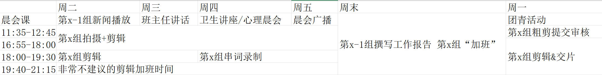

*注意：周一如果有需要下一组要提前拍摄。*  
*如果当周工作任务繁重，当周工作组可以联系下一组的其他干事帮助。*

---

### 设备篇

#### 学校设备清单

*注意：以下设备一般存放在剪辑室。*

**相机：**

- SONY PXW-X280 摄录一体机
- JVC JY-HM95 摄录一体机
- SONY DV 机 ×2
- SONY ILCE-6000（暂时借调位育科技）

**其他摄影摄像器材：**

- 三脚架 ×4（三脚架A损坏，慎用）
- DJI RoninSC 稳定器
- SONY 无线麦 ×2
- 枪麦 ×2
- WYTV麦牌 ×2（用于枪麦或无线麦）
- 工牌 若干
- SD 卡 若干
- 1TB 机械硬盘 若干
- 对讲机 ×6

#### 借还制度

学校的设备和工牌需要从剪辑室借取，具体规则如下：

- 仅限工作周的小组成员或经允许的非工作周小组成员可以借用。
- 借还器材时，**必须填写信息部设备借用登记表**，以便后续管理、减少麻烦。  
- 归还器材时必须为所有可充电设备充电（包括 dv、相机、稳定器、无线麦的电池和对讲机等）。

借还表基本样式如下：

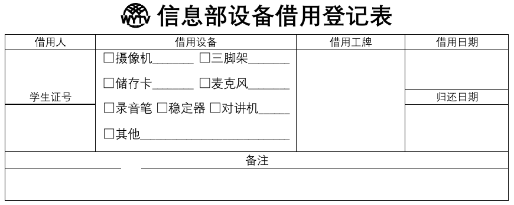

- **关于工牌：**  
正常来说工作周开始时组长借走 6 张工牌.外出拍摄期间，所有拍摄人员须全程佩戴工牌。播出前的晚上，组长将工牌归还至剪辑室并完成清点。

#### 使用资格认证制度

「稳定器」和「摄录一体机」由于使用难度稍高且年代久远，损坏器材可能性也稍高，**需要进行考核后才可使用**。

**考核流程**：

- 需要先向会使用的高二干事学习，学习完成后一天才可以进行考核  
- 考核需要在高二干事面前独立完成器材使用的全套流程。考核通过即可正常借用和使用。

>**注意事项**:  
>保护好学校器材，在外拍摄时不离开视线范围，按照正确步骤使用器材。  
>不做有损伤器材风险的事、不把学校器材随意借给其他人。  
>若出现了设备损坏或丢失的情况**需要自行照价赔偿**。

#### 个人设备

目前校方允许信息部干事信息部的名义将摄影器材带入学校。  
每次携带**需在上一周的周末填写大群中的问卷星进行报备**。

使用自己的设备拍摄前，**请确保设备能正常按照要求工作**，并自行准备好相关配件，以免素材无法使用。

学校和信息部不对器材的任何意外（损坏、丢失等）负责，请各位务必妥善保管个人设备。

## 职业卷

> **说明**：  
> 本指南中安排的职业仅作为干事的基本工作。如有需要（比如大型活动时），可以经组长协调，由组内人员担任其他岗位，也可以向其他组抽调人手。信息部鼓励和支持培养多面手与组间的交流学习活动，~~比如剪辑就可以把摄影的活包了~~。

### 摄影篇

摄影的主要任务以摄像为主，以拍摄照片（`.jpg`格式）为辅（但是需确保每场活动都有5张以上可用照片）。根据组长安排，有活动/采访/串词等拍摄任务时，提前拿好器材到对应地点准备。结束后清点、收好器材，带回剪辑室充电并放在指定位置。

*王嘉忱老师曾说：每个摄影都应当去当一遍剪辑，这样才能拍到剪辑想要的素材。*

#### 素材要求

- **画面**：最低 1080p25fps，建议 1080p50fps，不要拍摄规格过高的素材。保证曝光、白平衡等设置正确。保证所有素材构图正常，运镜合理。
- **音频**：需要用麦克风收音时，正式录制前务必先试音（录制并回听检查是否正常），防止意外。无线麦请及时充电，枪麦有开关，各种设备用完后请随手关闭。

#### 演出拍摄指南

在如艺术节等舞台演出场合拍摄时，常常会遇到拍摄机位重复、出现穿帮或互相干扰的情况，导致成片效果不佳。下面提供一个较优的舞台演出拍摄方案。

*注：后期会涉及到多机位剪辑，剪辑可参考下文`多机位剪辑`中的内容。*


拍摄前建议安排4-5个机位进行拍摄，请当周工作组组长及时联系抽调人手。  

**拍摄人员须在演出开始前10-20分钟入场并开始架设机位，具体要求如下：**

- **机位1：主机位：**  
  位置：位于观众席正后方中央，正对舞台（条件允许可放置于观众席正中，效果更好）。  
  设备：通常使用广播机拍摄，或其它较优秀的相机。
  任务：拍摄整个舞台全景，全程必须一镜到底录制，尽可能保素材的稳定与完整。
- **机位2：舞台中央特写：**  
  位置：位于观众席正后方中央，正对舞台（条件允许可放置于观众席正中，效果更好）。  
  设备：使用带液压云台的三脚架，装备长焦镜头。
  任务：拍摄特写镜头，可适当添加一些运镜（推拉摇等）。
- **机位3：舞台左侧特写：**  
  位置：观众席左侧过道中央处。
  设备： 使用带液压云台的三脚架，装备长焦镜头。 
  任务：拍摄特写镜头，可适当添加一些运镜（推拉摇等），可前与机位4沟通所拍内容（如机位3拍A角，机位4拍B角等）。
- **机位4：舞台右侧特写：**  
  位置：观众席右侧过道中央处，建议与机位3对称。
  设备：使用带液压云台的三脚架，装备长焦镜头。  
  任务：拍摄特写镜头，可适当添加一些运镜（推拉摇等）。
- **机位5：游动机位：**  
  位置：无固定位置，可自由移动（**注意不要长时间挡住某机位，严禁遮挡机位1，且在遮挡其他机位时必须保证自身素材可用**）。  
  设备：使用24-70mm等既包含广角也包含中/长焦的镜头，鉴于装备稳定器。  
  任务1：自由拍摄所有固定机位无法拍摄的素材，可自由添加运镜（推拉摇移跟等），例如：
    - 观众鼓掌、大笑、落泪的特写。
    - 以观众后脑勺作为前景拍摄舞台内容。
    - 以环绕式运镜拍摄主持人讲话。  
    - 演员上场前的花絮。
  
  任务2：拍摄照片，注意构图、曝光、白平衡合理。
- **录音：** 在舞台上方放置一录音笔，确保录音笔全程开启且能正常录制。

>**Tips:**  
>拍摄人数不宜过多。  
>拍摄时请勿来回走动、交谈或影响其他部门/学校的同学工作。   
>若产生上述情况可能会喜提年级主任/其他部门的投诉。


#### 600人会场照片拍摄指南

600人会场由于舞台设备较老，拍摄时常会遇到摩尔纹、素材过曝等现象出现，这里提供一种较优方案（以尼康Z30为例）。

##### 参数

- 格式：jpg
- 镜头：必须有广角（24mm及以下，用于拍合照），中/长焦可选
- 拍摄档位：S档（快门优先档）或M档
- 快门：1/50s
- ISO：自动
- 测光模式：亮部重点测光
- 曝光补偿：+1.7
- D-Lighting：最高（佳能相机则将`自动亮度优化`调至强，开启`高光色调优先`；索尼相机则将`DRO`调至强）
- 连拍：高速连拍（避免拍到人物闭眼/表情狰狞的照片）
- 闪光灯：在不能保证成片质量的情况下**不建议使用**。

##### 构图

要求：尽可能拍到全景，如舞台上有多人，尽量把所有人都拍入镜。特写可拍可不拍。

可以参考位育公众号上在600人会场举行的活动的配图，下面是一些示例：

<div style="display: flex; justify-content: center; align-items: flex-start; gap: 8px;">
  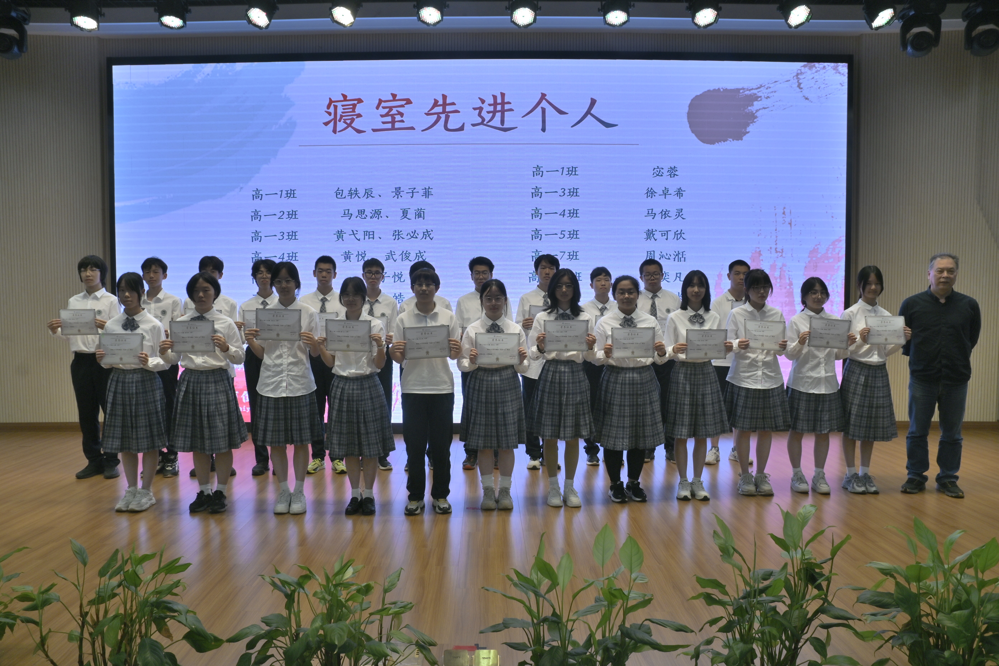
  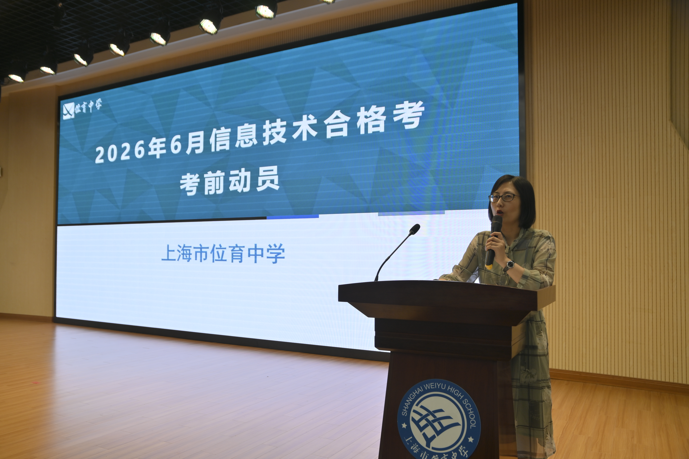
</div>


#### 注意事项

- 提升拍摄意识和个人审美，多看东方新闻，学习拍摄内容、构图、运镜等。
- 在拍摄的空闲时间或导素材时**请自行筛选素材**，将效果较差的素材删去。
- 拍摄帧率和快门速度设为 25fps 的整数倍。
- 使用直出色彩，不要拍摄灰片；**若无十足把握，请使用自动档**。
- 单条视频时长通常 5 秒以上最佳，避免画面严重晃动和大幅度的运动。
- 拍摄时自行寻找多角度，多景别拍摄。
- 不要迷信M档+手动ISO，等你调完参数黄花菜都凉了。

---

### 主持篇

主持的主要任务是录制串词和口播，进行采访，参与活动并记录现场情况。建议养成参加活动时带笔记本记录的习惯。

*注：串词是指在演播厅录制的视频；旁白（口播）是指和新闻内容同步播放的音频*。

#### 串词要求

串词必须按照如下框架进行撰写：

- **开场：**  
  A：老师们同学们，大家早上好。  
  B：欢迎收看本期位育新闻。
- **栏目：**  
  用简单的语言讲清要素（时间、地点、人物、事件、影响）。可从各处询问活动的更多信息，融入文案使其更具知识性。多看东方新闻，学习文案技巧。作为校园新闻，适当增加趣味性。
- **结尾：**  
  A：以上就是本期位育新闻的全部内容。  
  B：我们下期再见。

>**注意事项：**  
>录串词时统一穿校服，男女主持着装一致，仪容仪表整洁干净。  
>发音清晰、自信、响亮、有顿挫。

#### 采访要求

- **现场采访**  
    - 在活动现场寻找同学、老师，紧扣活动主题进行采访，避免偏题。  
    - 采访前先提前告知问题，并征求对方同意。
- **预约采访**  
    - 对象可能是同学、老师或其他工作人员，通常在特定方面有话语权或经验。  
    - 建议提前一天左右给采访对象提供”采访申请单”。
  
  *注意：采访结束后记得询问受访者个人信息（班级、姓名等）并做好记录，避免后期制作字幕、名牌时不清楚名字写法*。

采访申请单基本样式如下：

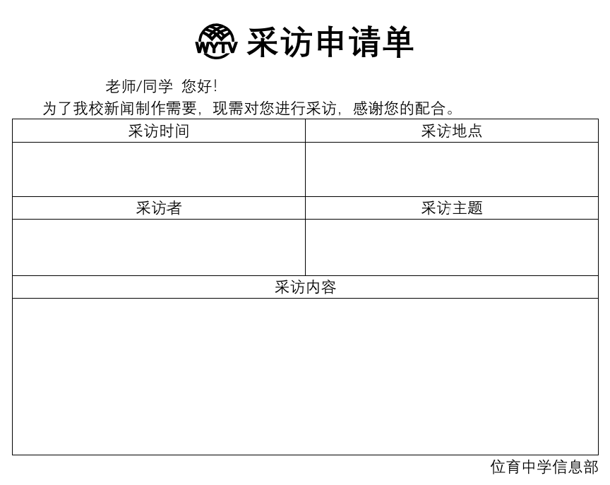

#### 旁白要求

- 点明日期、地点、人员，对事件简要概括（如遇比赛应包含比分、获胜队伍等），结尾点出事件意义（升华主题）。
- 注意政治正确，符合社会主义核心价值观，不得损害学校名誉。
- 可适当借助 AI 辅助完成。

---

### 剪辑篇

剪辑的工作类似于编导，是该新闻板块的总负责，需要从项目开始就参与其中，和主持与摄影沟通（比如沟通是否需要采访，需要什么类型的画面等），并完成视频的剪辑。

#### 软件

**Adobe 家族（2025 破解版，信息部主力工具）**

- **Adobe Premiere Pro (Pr)** – 视频剪辑
- **Adobe Photoshop (Ps)** – 图像处理
- **Adobe After Effects (Ae)** – 后期效果
- **Adobe Media Encoder (Me)** – 视频编码
- **Adobe Illustrator (Ai)** – 图形设计
- **Adobe Audition (Au)** – 音频处理
- **Adobe Lightroom Classic (Lrc)** – 图像编辑管理

> **注意事项**：  
> 新闻总剪 **必须使用 Pr**，新剪辑请尽快自学以掌握Pr的基础操作。  
> 推荐系统教程：<https://www.bilibili.com/video/BV1Uj411Q7tC> （详细全面，收获较大）。若时间紧迫可找速通教程。  
> Ae、Au 等也能在新闻中发挥作用，学有余力的同学可以尝试。

**其他推荐/常用软件**

- 剪映专业版（学校理论上提供会员）
- Everything（文件搜索）
- Ultimate Vocal Remover (UVR)（去除人声/水印）
- PluralEyes 4（音频对齐）
- FFmpeg
- Topaz AI
- Maxon Cinema 4D (C4D)
- Hedge（拷卡）
- 小丸工具箱（压制）

> 以上工具可按需学习，能为剪辑带来更多便利。  
> 学校还提供包图网会员。

#### 文件管理

##### 剪辑室电脑

作为剪辑，需要养成良好的文件管理习惯，为制作带来便利（很重要！！）（尤其在学校剪辑室工作时）。

四台电脑的大部分文件通过网线互相连通共享，方便多人合作。

每组开始工作时，**必须按照如下要求完成文件管理：**

- **工作文件夹结构**：  
  在 `2026学年工程文件` 中新建当期文件夹，命名格式：`播出日期_组别`  
  例：`20261010_一组`  
  其内部必须包含以下四个子文件夹：

  ```
  2026学年工程文件/
  └── 20261010_一组/
      ├── 素材/               ← 所有原始素材
      │   └── 活动日期_活动名称/  （例：20261216_艺术节达人秀）
      │         ├── 张三 尼康Z9/
      │         │     ├── 照片/
      │         │     └── 视频/
      │         ├── 李四 大DV/
      │         └── 录音笔音频/
      ├── 工程/               ← Pr 工程文件
      ├── 导出/               ← 成片
      └── 花絮/
  ```

>**注意事项：**  
>不要图方便直接在桌面或其他位置放置工程/素材；不要从 U 盘直接导入素材到软件。  
>所有素材**必须先复制到对应 `素材` 文件夹，再从该处导入**。  
>拷贝素材时**务必使用 “复制”**，切勿“剪切”，防止传输中断导致数据丢失。在确保所有素材全部传输完毕后再拔卡。必要时可学习使用拷卡软件（Hedge）。  

**切！记！保！存！**（短短四个字浓缩了多少辛酸泪）

##### 百度网盘

信息部使用百度网盘保存素材。

- **账号**：`墨污殘漬` (18******72)｜归属刘梓墨｜SVIP2 会员（年费至 20260820）  
  用于存放、传输信息部公用素材与文件。
- **使用人员**：
    - 仅供信息部高二留任干事及经同意的高一干事使用。
    - 未经同意的高一干事及所有非信息部干事 **不可使用**。
- **用途限制**：
    - 仅限信息部工作用途，禁止上传个人文件。其他特殊用途须经同意。
- **文件管理（必须严格按现有模式存放）**：
    - **`2026学年节目工程`**：仅存放原始素材，筛选后的素材等不要放进来。  
      一个活动一个文件夹，命名：`日期_活动名`（例：`20251216_艺术节达人秀`）  
      有多机位或分类需求时再建子文件夹。
    - **`临时分享`**：用于存放从 `2025学年节目工程` 中筛选出的素材、剪辑工程文件、成片等（如某班素材、活动快剪）。  
      子文件夹命名：`日期_活动名_更细分类或备注`。  
      此文件夹常用于整理、分享和交片。
- **登录方式**：
    - 个人设备可通过扫码登录（找刘梓墨）。
    - 剪辑室两台电脑无特殊情况保持登录状态。

#### 新闻制作规范

##### 总剪模板和新闻框架

一期常规的新闻包含 2～4 个栏目，成片总时长 8～10 分钟。需要在制作前和组长沟通好各板块时长。

- 新闻整体架构大概是：  
  >片头 → 开场口播 → 新闻内容概览 → [栏目 → 转场] × n → 结尾口播 → 片尾

- “总剪模版”中已搭建好新闻整体架构和包装，各组使用前把总剪模版工程复制到自己组的工程文件夹中并按照如上架构制作新闻。具体使用方式请看`包装`部分。
*注：部分模板（比如转场特效）包含透明通道，其结束位置会有明确的标记。**请务必保证：从模板开始播放，一直到这个标记位置的时间段内，模板下方的轨道上始终铺着视频或图片素材，不要留空**。*
- 在“文字总控制”序列中调整文字，总剪序列中将同步更改。  
*注：组名用中文字符表示（例：一组），月份和日期用两位数字表示（例：05月07号）*

文字总控制轨道图例：
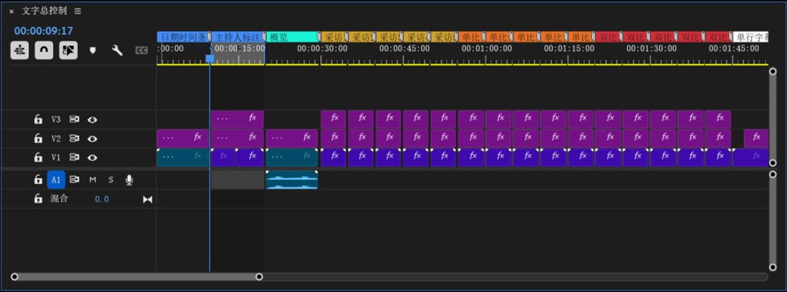

*注：如果遇到需要把视频带回去剪的情况，为避免因为版本差异无法打开工程文件，可以使用网页工具（<https://joshcluderay.com/downgradepremiere-project-converter/> ）对 pr 工程文件进行版本降级处理。*

##### 视频号剪辑

部分位育新闻切片会进行二次剪辑加工后发布在学校视频号上，视频号同样有对应的模板，使用逻辑和总剪模板基本一致。

*注：需要注意视频号审核尺度会比校内位育新闻更加严格。*

##### 画面要求

- 成片统一 横屏 16:9 1080p 25fps。

- 粗剪后需要关注视频画面的曝光、白平衡、色调等是否合适，可以使用“Lumetri 颜色”滤镜进行基础的调色和修改。

- 如果视频构图存在严重缺陷请更换素材并提醒拍摄者，实在不行多次复用优秀的素材也可。

- 画面抖动可以采用`效果-变形稳定器`后期增稳。

- 如果使用到了蓝幕背景或包含绿幕的素材，可以使用`效果-超级键`进行抠像处理。

##### 音频要求

- 峰值电平控制在-6dB～-12dB，**请在最后导出前进行检查**
- 若出现出现收音环境嘈杂的情况，可以通过`效果-降噪`，`效果-减少混响`进行降噪。

- 活动快剪可以适当添加 BGM（背景音乐）。
    - BGM 要符合内容的风格情绪，合乎基本审美。
    - 不建议正式场合使用带有外文歌词或歌词敏感的歌，建议以纯音乐为主。

    - 音乐可以通过网易云音乐等方式下载，`*.ncm` 格式的音乐可以通过网页工具（<https://ncm.worthsee.com/> ）进行转换

    - 部分带有歌词的 bgm 可以经过 **Ultimate Vocal Remover (UVR)** 去人声处理后使用。  
  参考资料见“其他资源”中的《UVR 中文帮助手册》。

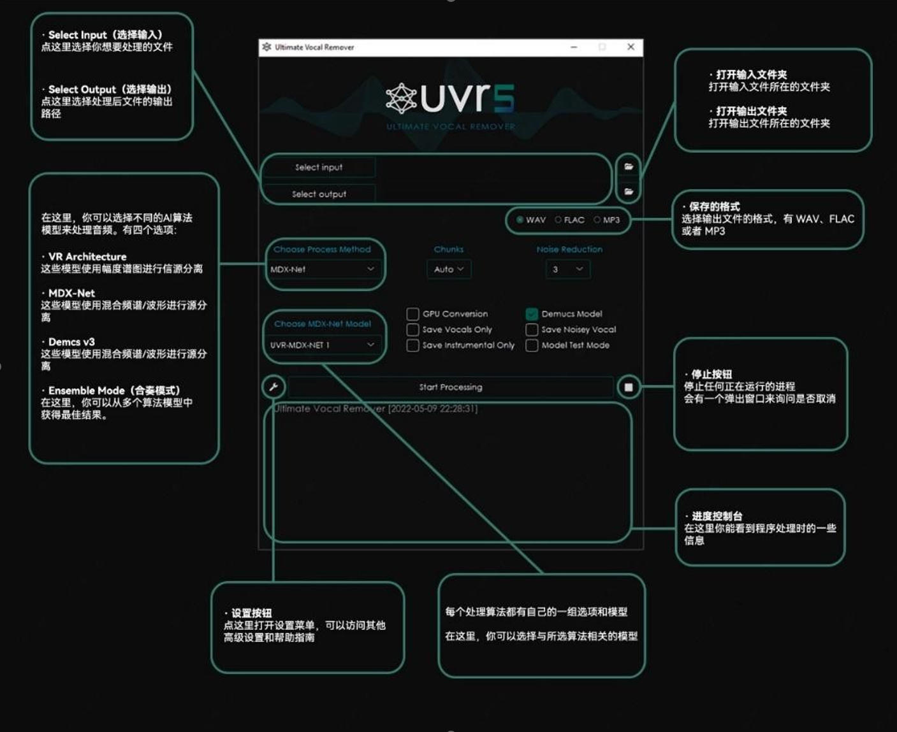

##### 字幕要求

除开场/结尾口播外，其余口播、采访等都需要添加字幕，可以用剪映导出xml文件或使用 Pr 自带的字幕识别功能等方式制作字幕。

下面提供使用 Pr 转录字幕的教程：

1. **创建转录文本：**  

    在拖入视频素材后，Pr 会自动对素材的文本进行转录，如下图 ① 所示：
    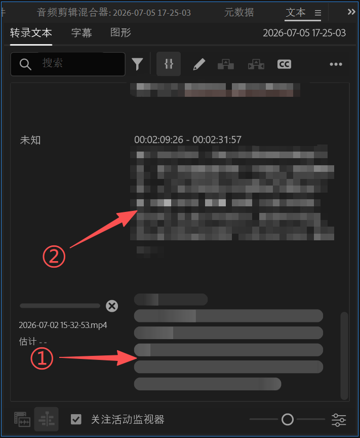

2. **修订字幕内容：**  
    转录后的文字（上图 ② 的马赛克内容）通常会有许多错误内容，请根据口播稿进行修订。

3. **创建字幕（一般字幕条里的字幕）：**  
    在`字幕`板块点击**从转录文本创建字幕**，并调整设置为单句最长 13 字符，最短持续时间 2 秒，单行，样式为**单行字幕统一样式**。
    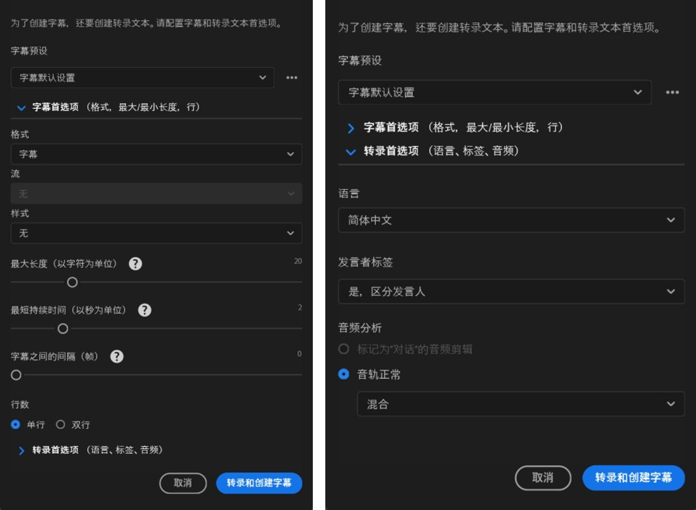

4. **修订字幕：**  
    Pr 自动识别的字幕可能存在断句错误，误加标点等问题，请自行调整字幕断句并删去标点。

*注1：由于 Pr 字幕轨道的“特性”（只能同时显示一条字幕轨，一个序列只能转录一次），请灵活使用嵌套功能。*  
*注2：通过剪映进行字幕识别准确度会高一点，此处不过多赘述，感兴趣可以向王嘉忱老师或留任干事请教。*

##### 包装要求

- 开场口播需要加主持人名牌、日期条，其余口播、采访需要加字幕条（和名牌）。

- 主持人名牌写组别（中文字符，例：一组）+主持人名字。

- 字幕条一般用“单行字幕”，如有英文字幕/备注等可用“双行字幕”。

- 全片除片头片尾外，其余部分在最上层加台标。

- 转场视频带有透明通道，使用时务必注意轨道层级关系。

- 导出纯剪版时，应隐藏除转场视频以外全部包装。

***注：强烈建议导出前按照此标准检查上面所有内容，经常有人忘***

##### 导出和留档

1. **完整版导出**  
   导出至 `导出` 文件夹，命名：`播出日期年月日`（如 `20261010`），码率约 10Mbps。  
   同时复制一份至 `2026成片（完整版）` 留档。

2. **压制版导出（用于播出）**  
   使用 **小丸工具箱** 压制为 `播出日期_h.264`，（如 `20261010_h.264`）CRF 33～34（数值越小质量越高，相应的文件也会变大），压至 ≤100MB（为保证播放不卡顿，校网视频大小需要≤100MB）。
   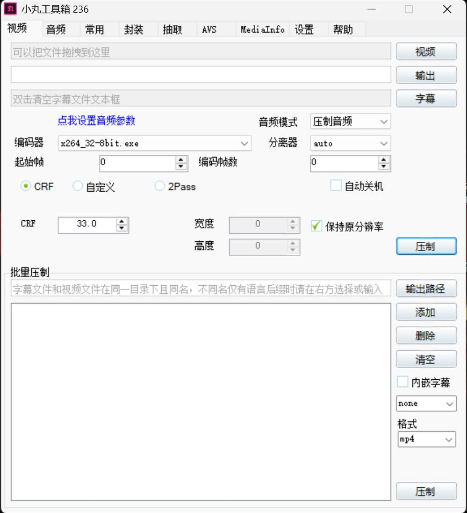
   以上是小丸工具箱的软件界面，正常情况下无需过多调整软件参数。  
   同时复制一份至 `2025成片（压制版）` 留档。

3. **纯剪版导出**  
   暂时隐藏字幕、包装等，另导出一份 `播出日期（纯剪版）` （如 `20261010.mp4（纯剪版）`）至 `导出` 文件夹，码率 10Mbps。  
   同时复制一份至 `2025成片（纯剪版）` 留档。

#### 注意事项

- 剪辑时间不算充裕，为防止播出前手忙脚乱，请抓紧一切在剪辑室剪辑的时间或者将素材带回家，在周末进行加班。

- 不建议在总剪里进行各栏目的剪辑，而是针对每个栏目各开一个项目，视频剪辑完成并导出后再导入总剪。

- 以上是基本要求。作为剪辑，后期的空间是无限大的，成片的上限是无限高的，希望大家可以在完成常规流程任务之余充分发挥后期的创意，比如进行调色、动画制作、添加各种各样的音效等方式来提升视频观感，做到精益求精。

---

### 组长篇

组长是一期新闻的总负责。主要负责进行本组新闻的整体统筹策划，从体育组和年级组长等方面获取下一周活动安排后，提前安排好各组员的任务，协调好各组员的工作，营造良好的工作氛围。作为高一高二干事之间的桥梁，及时串通信息。

*注：当本期新闻内容过多或人手不够时，当周工作组组长可和下周工作组组长沟通后共同完成本期新闻。*

#### 新闻内容安排

一期常规的《位育新闻》需要包含 2～4 个栏目，时长 8~10 分钟。栏目主要包括“活动回顾”、“活动预热”、“位育大讨论”等，展现位育多彩的校园生活。（按需安排下新闻内容即可）

##### 「活动回顾」

- 主要是上一周学校或学生团体组织进行的活动，需要安排人员拍摄，有必要时进行采访（详见主持篇）。此部分可以以口播、快剪、采访等形式出现。建议口播时长不小于总时长的 1/3。

##### 「活动预热」

- 宣传将要进行的活动内容，可以寻找前一年相关活动的片段播出，也可以和组织活动的相关部门合作，拍摄宣传片（如我们曾和社会实践部合作，拍摄过爱心义卖的小短剧）

##### 「位育大讨论」

- 位育大讨论的主要目的为给同学一个自由的平台对于生活中的热点事件、校园生活等发表自己的观点并与大家分享。每组决定各自的位育大讨论内容，交给正副部长审核。而后各组成员可以以问卷、采访等形式获得大家的看法，并将内容整合为一个视频，作为新闻的一个栏目。

- 由于制作难度较大，且周期不定，建议提前开始进行，做好视频后作为“库存”，在新闻时长较短时放出。原则上每组应尽早完成一期"位育大讨论"的储备。

*注：「位育大讨论」的范畴非常广泛，从讨论应当如何对待校园中的流浪猫，到介绍食堂阿姨的日常工作，都可以算作「位育大讨论」。~~我也不知道为什么。~~*

##### 注意事项

- 新闻中**禁止由制作人员“夹带私货”**，如进行非官方推广、进行有损信息部甚至学校名誉的负面宣传等，请组长协助监督。

- 当然！除此之外，我们鼓励在不妨碍常规内容开展的情况下充分发挥合理的创意，体现《位育新闻》有趣的一面！（建议拍摄前先将节目大纲递交团委审核，以避免拍一半被枪毙的情况）

#### 视频审核与提交

- 周一中午前由组长自行审核视频。确保符合社会主义核心价值观，不出现原则性错误等。（切忌在正式场合和提及校领导时引入玩笑元素）

- 周一中午前需将视频初稿（未上字幕，调色，部分细节内容可以没有完成）交给团委老师审核，有则需要及时修改，无则留待周一晚上完成制作，交片（由负责老师来上传至学校网站），下班。

*注：总剪的导出一般耗时 10min 左右，压制时长也在 10min 左右。请提前预留足够的时间给导出和压制。**在最后导出前需检查全片内容，尽可能避免出现细节上的错误导致需要返工。***

#### 新闻内容的总结与复盘

- 在完成一周的工作内容后，组长需要和组员复盘本轮工作中遇到的问题和值得圈点的地方。为节省其他部员们的时间，同时积累工作经验，通过撰写一份工作报告的形式代替部门集体开会。

- **工作报告提交规范：**  
  1.工作报告名称统一命名为`xxxxxxxx（播出日期年月日）信息部工作报告`  
例：20251125 信息部工作报告。

  2.撰写完成后另存为 PDF 格式上传至“2026 信息部”微信群，供信息部各组之间交流和学习。

信息部工作报告的模板大致如下：

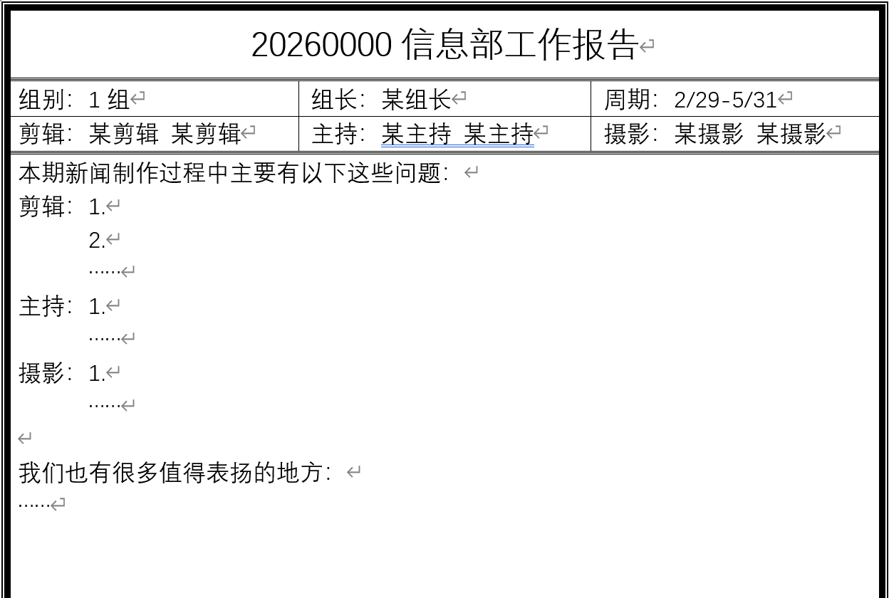

## 活动卷

### 位育中学每学年活动大致情况

以下是位育中学一年活动内容大致安排（位育大事年表）：

- 7 月：新生进入校群，部门宣传开始

- 8 月：高一新生军训

- 9 月：开学典礼，部门招新，社团招新，教师节祝福活动，社团游园会

- 10 月：明信片跨校互寄，体育文化节

- 11 月：篮球精英赛，羽毛球精英赛，乒乓球精英赛，足球精英赛，高二学农，高一英语配音比赛

- 12 月：艺术节（好声音&达人秀），高二英语演讲比赛，高三成人仪式，高一研学

- 1 月：元旦祝福，春考采访，朗诵比赛

- 2 月：爱心义卖

- 3 月：排球班赛

- 4 月：（高一东方绿舟军训-根据学校抽签顺序决定）

- 5 月：高二足球班赛，高三喊楼，寝室文化节，高二南京研学

- 6 月：入团仪式，科技节，戏剧节，高三毕业典礼

*注：具体时间可能会因安排有所变动，请以实际情况为准。*

---

### 信息部负责组织和策划的活动

信息部负责高三毕业季系列活动。包括高三年级走廊“助威”栏布置、毕业季视频、高考喊楼助威等活动。

（下面援引信息部 2024 届高三毕业季系列活动策划案）

#### 教师节祝福视频收集制作

- 联络各班班长约定时间采访，内容为同学对全校全体老师的祝福，需要注意应把控采访对象的着装和举止，审核时需要多加注意！

附：班长通知

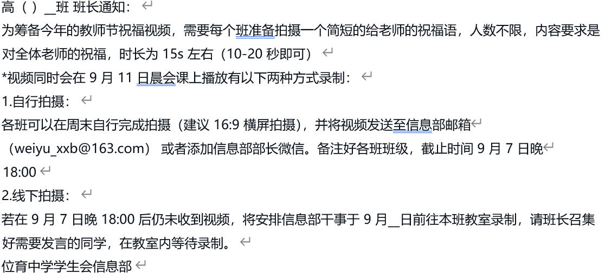

#### 高三年级走廊“助威”栏布置

- 在高三公告栏旁放一块特殊的助威展板，或将荟育楼底楼的柱子装饰为贴栏，通过班长发放小卡片（每班 8 张），并在展板旁放置小卡片（20张），让各年级师生为高考生们献上美好祝愿，也可定点提供合影，一方面也可为毕业季视频收集素材。预计准备小卡片 230 张。

- 时间：5 月 13 日至 6 月 8 日。

*注：卡片可定制位育高考特别款，也可留作毕业纪念。*

#### 高三毕业季视频

1. **高三高考祝福视频：**  
  按惯例，高三高考祝福视频一般包含两类要素：
    - 毕业的学长学姐和校内的老师、学生对高三考生的高考祝福视频。
    - 合唱团、电声乐队社等为高三考生演唱的歌曲。  

    需要由信息部高一干事收集素材，并进行分类与加工，以一期位育新闻播放，为高三同学们加油助威。
2. **高三毕业典礼视频制作：**  
联络高三年级组长、各学科备课组长、各班班主任约定时间采访，为高三毕业生送上祝福。  
同时需要收集整理所有有关高三年级的视频内容，制作回忆向混剪。可以从旧新闻成片中“炒冷饭”，也可以向高三学生收集需要的视频素材。

#### 高三高考喊楼助威活动

*注：高三喊楼活动可能因不可控因素导致无法举办，请向相关老师咨询。*

（下面援引信息部 2024 届高三毕业季系列活动策划案）

暂定于 5/30 日中午 12.20~40 在荟育楼中庭举行

任务安排分为：合唱团（约 25 人）、参与喊楼环节的信息部高一干事、高二留任干事和有意愿参与喊楼环节的同学（约 25 人）。

其中高二干事负责秩序维持，安排高一干事站位，高一干事分别参与拍摄和喊楼环节（4+15），高二留任干事集中在中庭，高一干事分散在荟育楼二楼。

预热：在喊楼活动当天的位育新闻公布活动，且在当天大课间通过广播站发布活动通知。

活动流程：提前准备好音箱与麦克风，信息部部长与部员按照撰写好的主持词主持活动，把控现场氛围，开场白之后，请合唱团部分成员演唱大合唱曲目，合唱曲目结束后，由主持人领头喊楼，参与喊楼的成员重复呐喊，以增强气势，起到加油助威的效果，结尾可以以一首歌结束。

（设备借用细则及筹备节点见附录 2）

注：约在 5/5 日前确定喊楼文稿、合唱团曲目与人员名单。所有的流程规划都将提前以通知形式发往高一高二的班级。

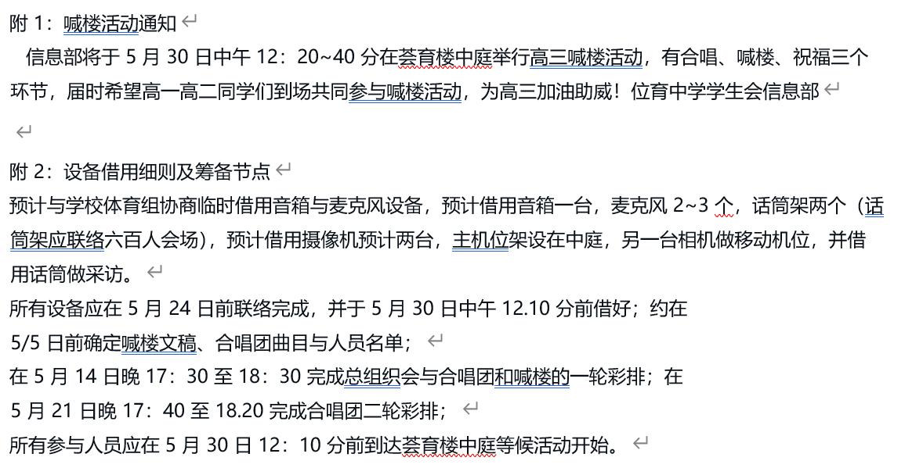

#### “写给一年之后的自己”明信片活动

- 5/12 日发布活动通知在班长群，活动结束于 6 月 14 日，所有高三生都可以领取明信片或自备明信片等，写给一年后的自己，并填写一年后寄往的地址和联系方式，信息部将在一年后将明信片按照地址寄出连通时光中的高中记忆。（预计准备 100 张明信片）

#### 高三“位育精神”传承

- 在毕业典礼结束后，高三同学可以把自己想留给学校、学弟学妹的话写在明信片、信里留在教室课桌里，教室的柜子、或者宿舍的抽屉里（具体地方与团委和总务处商定），可以将他们的感悟或者鼓励带给下一届的同学们，传承位育人的“八自六气”。

#### 注意事项

- 具体活动的形式和内容可能会因学校安排有所调整，请以当年学校安排为准。如不清楚可联系团委老师。

## 进阶卷

这里是一些较为进阶的内容，供希望进一步提升视频质量的干事阅读并学习，也欢迎有能力的干事进一步完善本卷内容。

### 多机位剪辑

在艺术节、戏剧节、喊楼等场合可能会遇到多机位剪辑的需要，下面提供基于 PluralEyes 4 进行音频对齐的多机位剪辑教程：

0. **前期准备：**  
    - 拍摄时确保所有机位麦克风打开且收音质量较好（可以通过外接麦克风解决），录音笔已开始录制。
    - 建议在拍摄前校准所有相机的日期和时间，以方便后期整理素材。
    - 拍摄完成后，按照相机对素材进行分类。

1. **使用PluralEyes 4进行音频对齐并导出序列：**  
    （1）选中所有由同一相机拍摄的素材，将其依次拖入PluralEyes 4中，如下图所示：  
    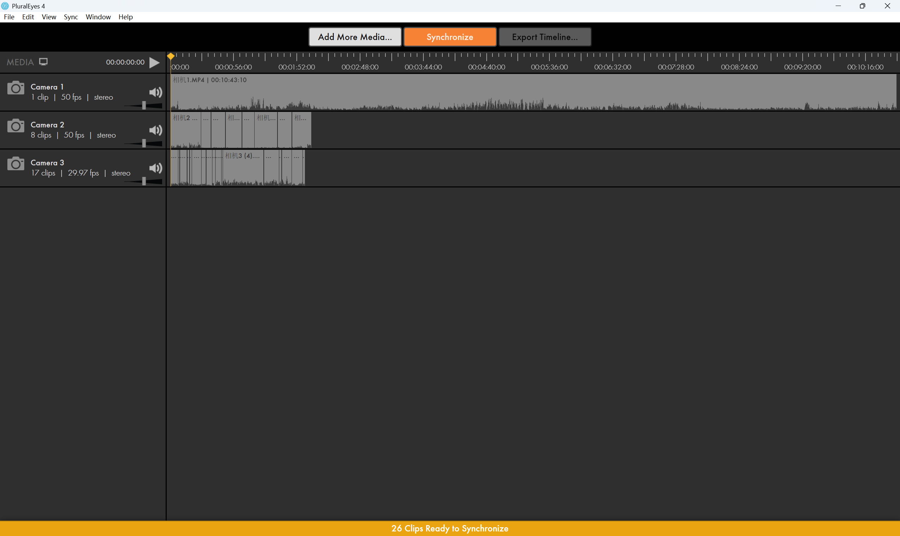
    *注：PluralEyes 4默认会将每次拖入的文件视作同一机位的素材，如需增加单个机位的素材，可通过`右键点击Camera - Add Media`实现。*

    （2）点击`Synchronize`，等待软件分析音频并自动对齐（可能会消耗较长时间，请耐心等待），如下图所示：
    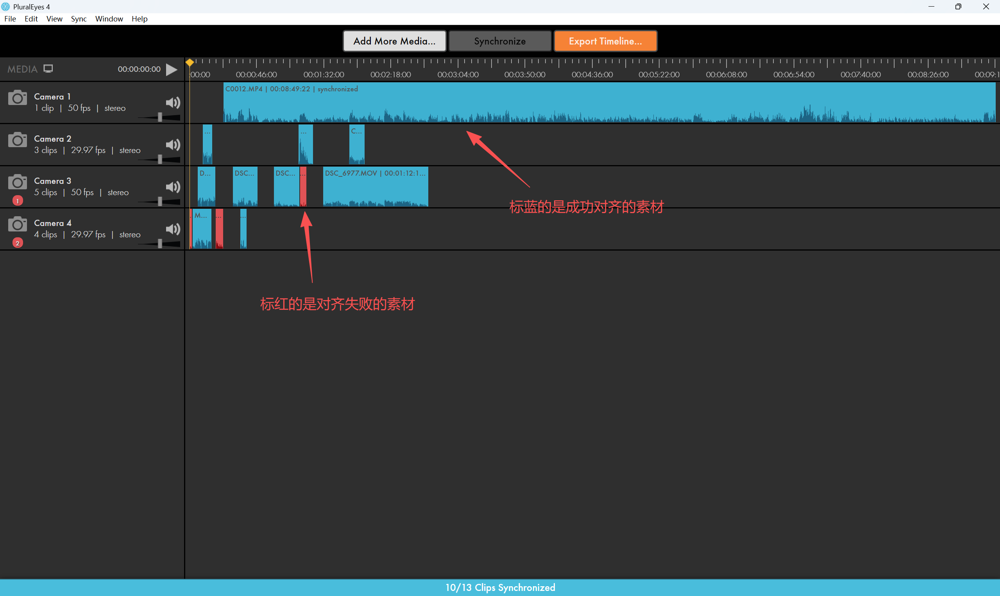

    （3）点击`Export Timeline`，调整设置至如下图所示，最后点击`export`导出：
    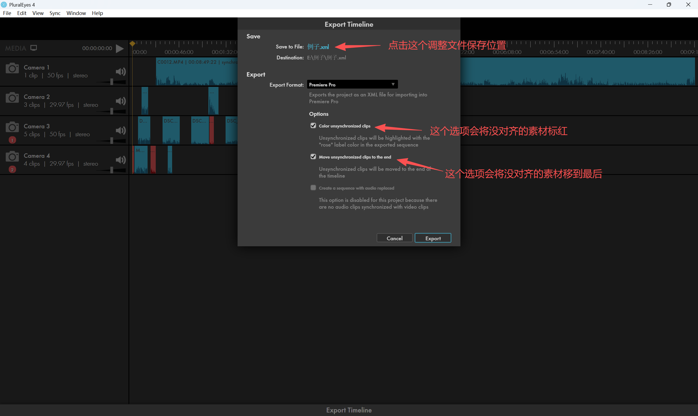

2. **使用 Pr 进行多机位剪辑：**  
    （1）打开 Pr ，将 PluralEyes 4 导出的`.xml`文件拖入项目中，双击打开`Synced Sequence`序列并并修改最终使用音频、对素材进行必要调整：
    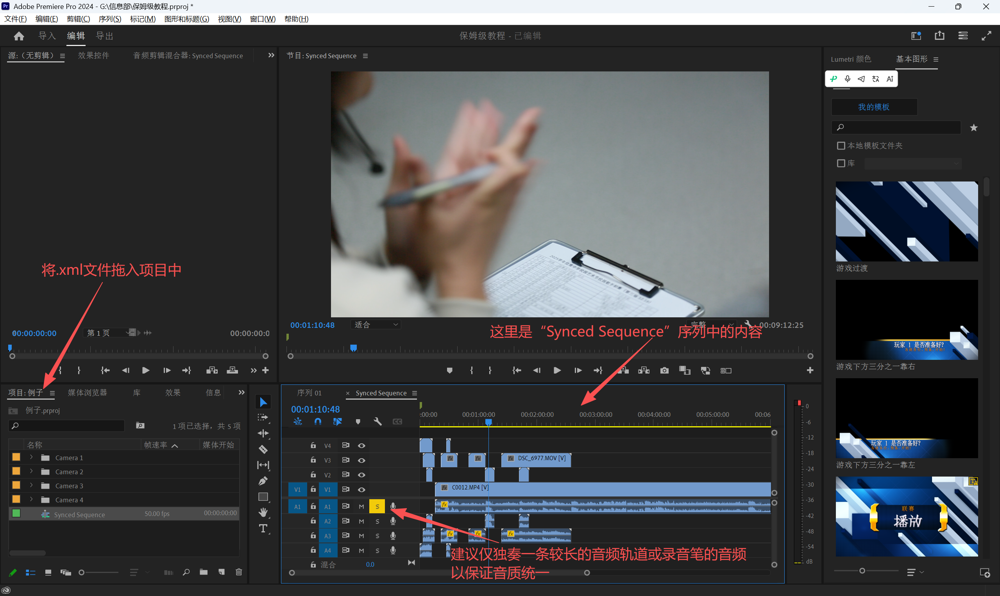

    （2）回到原序列，将`Synced Sequence`序列拖入，并右键序列，选择`多机位-启用`，按`Shift+0`启用多机位视图：
    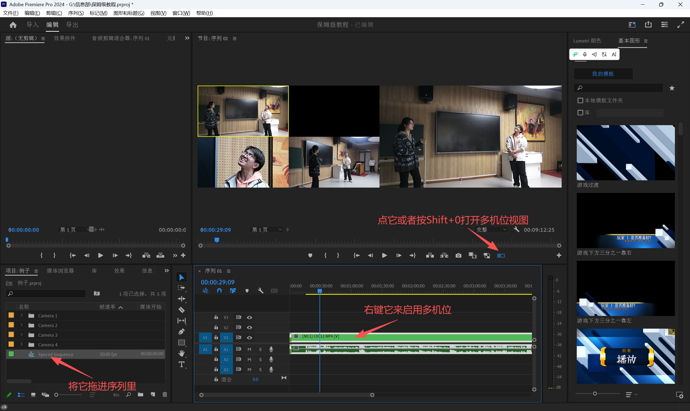

    （3）开始多机位剪辑：在多机位视图下，播放时，直接用鼠标点击左侧的不同小窗口，或按数字键 `1`、`2`、`3`……实时切换机位，右侧为实时图像，PR 会自动添加切换点。如上图所示↑

    （4）切换完成后，可在时间线上拖动切割点、添加过渡或根据整体效果单独调整某机位的色彩。

---

### 600人会场转播

600人会场是学校举办大型活动（艺术节、开学典礼、毕业典礼等）的主要场所。当活动需要实时转播（如通过校园网直播或分会场同步观看）时，信息部需负责现场多机位信号的采集与切换。

>**注意事项：** 由于各种因素的限制，目前尚未完成此工程的落地，本篇基于学校现有设备和网络资料编写，如和实际情况存在出入，请以实际情况为准。

#### 器材

转播涉及的器材分散存放于多处，活动前务必提前清点和协调借用。

##### 线材与转接（位于理育楼108 线材箱）

| 器材 | 说明 |
| --- | --- |
| SDI线 | 多根，不同长度，是转播系统的主要信号线 |
| HDMI线 | 多根，不同长度 |
| SDI↔HDMI转换盒（蓝色小盒） | 若干，**需外接供电**（USB或DC供电），注意区分输入/输出方向（公母口不同） |
| HDMI→Micro HDMI线 | 用于连接微单等小口HDMI设备 |

##### 摄像机

| 型号 | SDI输出 | 说明 |
| --- | --- | --- |
| SONY PXW-X280 摄录一体机 | 支持 | 机身自带SDI OUT接口，可直接连接切换台或图传发射端 |
| JVC JY-HM95 摄录一体机 | 视输出接口而定 | 若仅有HDMI输出，需经转换盒转为SDI |
| SONY ILCE-6000 等微单 | HDMI（Micro HDMI口） | 需 HDMI→Micro HDMI线 + SDI转换盒 |

*注：最终进入导播台或采集卡的信号必须是SDI。*

##### 无线图传（新锐视听 X-SHWX 系列）

图传用于不便布线的游动机位，将摄像机信号无线传回切换台。设备目前由**邱老师保管**（据称送修中已数月，使用前务必联系确认状态）。

- **型号**：新锐视听 X-SHWX-400M
- **组成**：发射器（Transmitter）×1 + 接收器（Receiver）×1，需配对使用
- **接口**：
  - 发射端：HDMI输入 + SDI输入（二选一或同时）+ SDI环出（本地监看）+ 3.5mm音频输入
  - 接收端：HDMI输出 + 双路SDI同时输出
- **传输距离**：400米（视距，无遮挡），墙壁阻隔会显著缩短距离
- **画质**：最高1080p 60Hz，无压缩、无延时
- **通道**：10个频道（0~9），通过机身OLED屏和按键手动切换。同一空间最多支持4套同时工作（需设不同频道）
- **供电**：DC 7~36V宽电压输入（LEMO 2针接口），支持摄像机电池（V口/安东口等扣板，视配件而定）

**使用前确认事项**：
- 发射端和接收端是否设为**同一频道**（0~9），OLED屏上可查看当前频道和信号强度（RSSI）
- 天线是否已全部拧紧，方向垂直朝上
- 开机后观察OLED屏是否显示视频格式信息，确认已锁定信号
- 600人会场内使用时可开启**AFS自动频率扫描**，避开现场WiFi等无线干扰

##### 切换与采集设备

| 设备 | 存放位置 | 说明 |
| --- | --- | --- |
| SDI采集卡 | 600人会场后台电脑机箱内 | 已安装，用于简易方案 |
| BMD ATEM Television Studio Pro 4K 切换台 | 邱老师处（演播厅博育楼5楼） | 广播级8路SDI切换台，**借用需提和邱老师沟通** |

##### ATEM Television Studio Pro 4K 简要参数

- **品牌**：Blackmagic Design（BMD），老款型号
- **输入**：8路SDI（3G-SDI，最高1080p60），各输入口自带帧同步和格式转换
- **输出**：SDI节目输出（多路）、HDMI多画面监看输出、AUX辅助输出
- **音频**：XLR平衡输入、RCA输入、SDI嵌入音频，内置音频混音器
- **控制**：机身自带物理按键面板 + 电脑端 ATEM Software Control（BMD官网免费下载）
- **网络**：通过Ethernet连接控制电脑，默认DHCP，可手动设置固定IP

> **参考**：官网入门指南 https://www.blackmagicdesign.com/cn/products/atemtelevisionstudio/gettingstarted

#### 简易方案（SDI采集卡 + 后台电脑）

适用于单机位或双机位的临时转播需求。

##### 信号链路

```
摄像机(SDI OUT) ──SDI线──→ 600人会场后台电脑(SDI采集卡) ──推流/切台软件──→ 校园网/大屏
```

##### 操作流程

1. **连接摄像机**：使用SDI线连接摄像机SDI OUT口至后台电脑采集卡的SDI IN口。
2. **启动软件**：打开电脑上的推流/切台软件（如OBS Studio）。若有多路信号，电脑上另有一简易切台程序可用于基本画面切换。
3. **配置信号**：添加"视频捕获设备"，选择采集卡对应设备。将分辨率设为1080p，帧率与摄像机保持一致（25fps或50fps）。
4. **推流输出**：通过校园内网推送信号至指定播放终端，或直接输出至分会场大屏。

> **注意：**
> - 简易切台程序仅支持硬切（Cut），无转场特效。
> - 确保电脑存储空间充足，可同步录制留存。
> - SDI线走线沿墙边固定，避免绊人。

#### 复杂方案（BMD ATEM 切换台 + 多机位）

适用于3路以上多机位大型活动的正式转播。

##### 信号链路

```
摄像机1 ──SDI──┐
摄像机2 ──SDI──┤
摄像机3 ──SDI──┼── ATEM切换台 ──SDI PGM输出──→ 采集卡/推流电脑──→ 校园网/大屏
游机 ──图传发射端~~无线~~图传接收端──SDI──┘       │
                                              HDMI多画面输出 → 监视屏
```

##### 图传配置（游动机位专用）

若场地内有不方便走线的游动机位（参考摄影篇中《演出拍摄指南》的机位5），可使用无线图传将信号送回切换台：

1. **发射端连接**：
   - 将摄像机SDI/HDMI输出接入图传发射端的SDI/HDMI输入口。
   - 如需本地监看，利用发射端的SDI环出口接小监。
   - 安装天线（2根），垂直朝上。使用摄像机电池（V口/安东口扣板）或DC电源供电。
2. **接收端连接**：
   - 将接收端放置于切换台附近，安装天线（5根），垂直朝上，DC供电。
   - 接收端SDI/HDMI输出接入切换台某一路SDI输入。
3. **配对设置**：
   - 发射端与接收端调至**同一频道**（通过OLED屏旁按键选择0~9），OLED屏显示频道号和当前视频格式即配对成功。
   - 在多套图传同时使用时，确保每套使用不同频道（最多4套共存）。
   - 开启**AFS自动频率扫描**功能，自动选择干扰最小的频道。
4. **信号确认**：观察接收端OLED屏上的RSSI（信号强度指示），现场使用时注意不要超出视距范围或被金属结构、人群大面积遮挡。

##### 架设流程

1. **布置固定机位**：根据活动需求布置3台及以上固定摄像机（参考摄影篇中《演出拍摄指南》的机位方案），通过SDI线连接至切换台。

2. **连接切换台**：
   - 将各固定机位SDI线 + 图传接收端SDI输出 接入 ATEM 的 SDI IN 1~8。
   - 切换台 SDI PGM OUT 连接至推流电脑的采集卡。
   - 切换台 HDMI MULTIVIEW OUT 连接一台独立显示器，用于多画面监看（可同时看到所有输入源、预监和节目画面）。
   - 用网线连接切换台与控制电脑（或接入同一局域网）。

3. **配置控制软件**：
   - 在控制电脑安装 ATEM Software Control（BMD官网免费下载）。
   - 将控制电脑IP设为 `192.168.10.*`（`*` 不可设为240），与切换台同网段。
   - 启动软件，自动发现并连接切换台。

4. **接入音频**：600人会场活动时，可联系**汤老师（博育楼407电教室）**从调音台获取音频信号，接入切换台XLR输入或推流电脑音频输入。

##### 基本操作

1. **确认信号**：在多画面监看屏确认所有输入源正常（包括图传画面），无黑屏、闪屏、无线干扰马赛克。

2. **切换步骤（推荐使用Program/Preview模式）**：
   - 下方 **Preview行** 选择待切换信号（高亮绿色），确认画面无误。
   - 按 `AUTO` 键或推动 T-Bar 推杆完成切换。
   - 切换完成后Program/Preview行自动交换，当前播出信号始终高亮红色。

3. **转场特效**：

   | 特效 | 效果 | 使用场景 |
   | --- | --- | --- |
   | MIX（叠化） | 平滑渐变过渡 | 最常用，各类场景通用 |
   | DIP（浸黑） | 短暂变黑后切入 | 段落切换或情绪转折 |
   | WIPE（划像） | 从一侧划入 | 快节奏切换或特殊效果 |
   | CUT（硬切） | 即时切换 | 直接点击Program行按钮，谨慎使用 |

4. **音频管理**：在ATEM Software Control中调节各输入源嵌入音频的电平（峰值控制在-6dB~-12dB），避免爆音。

> **切台基本原则：**
> - 不要在运动镜头中间切换，等画面稳定后再切。
> - 特写→全景、全景→特写的切换比同景别切换更自然。
> - 提前与各机位摄影师约定构图分工（如1号机全景、2号机中景、3号机特写、游机拍观众反应和花絮），避免所有机位画面雷同。

#### 注意事项

- 转播任务需**至少提前一周**确认方案（简易/复杂），预留时间协调设备借用和线材准备。
- 演播室方案链路复杂，建议**至少2人协作**：一人操作切换台，一人监看多画面 + 协调各机位（含游机）。
- **图传设备目前由邱老师保管，据称送修中已数月**，如需无线机位，提前联系邱老师确认图传是否可取、状态是否正常。
- 切换台同样由邱老师保管，借用前需充分沟通、说明必要性，承诺规范操作、用后完好归还。
- 活动结束后清点所有器材（线材、转换盒、切换台、图传及其天线和供电配件等），线缆收卷时勿过度弯折，转换盒等小型配件易丢失，务必当场清点数量、归还到位。
- 转播时可使用OBS同步录制留存（MP4格式），方便后续新闻素材回取。

## 写在最后

### 贡献者

- 第一次修订（v2.0） 朱轩宇
- 第二次修订（v3.2.2） 刘梓墨
- 第二次修订（v3.2.2） 李义霖
- 第三次修订（v2026） 熊家祯

### 说明

本工作指南已重写为markdown格式，在Github上保存，仓库位于[wytv-instruction](https://github.com/Dr0ge/wytv-instruction)（https://github.com/Dr0ge/wytv-instruction） 下，目前由[@Dr0ge](https://github.com/Dr0ge)维护，如需修改请联系熊家祯（或后人）。

渲染skill位于[wytv-markdown-to-pdf](https://github.com/Dr0ge/wytv-markdown-to-pdf) （https://github.com/Dr0ge/wytv-markdown-to-pdf） 下，如有需要可自行获取。

***「墨门永存！」***
<p align="right">—— 熊家祯 2026/9/6</p>
